# SnackMates-Server

SnackMates-Server is a food ordering platform that provides a server-side API to manage restaurants, menus, user favorites, and authentication. This server-side application is built with Node.js and Express, and it interfaces with a MySQL database to handle various CRUD operations.

## Features

- User authentication (registration and login)
- CRUD operations for restaurants and menus
- Favorites management (add, get, and delete)
- Search functionality for menus by type

## Technologies

- Node.js
- Express.js
- MySQL
- JWT (JSON Web Tokens) for authentication
- dotenv for environment variables
- body-parser for parsing JSON request bodies

## Architecture Diagram

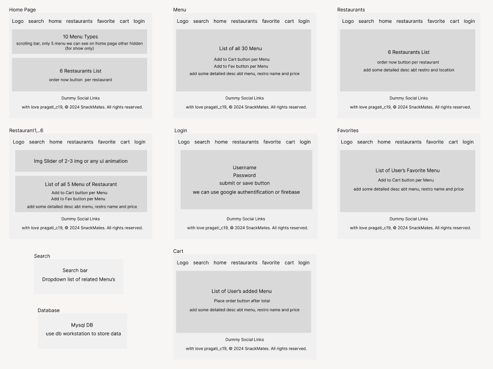

## Setup and Installation

1. **Clone the Repository**

   ```bash
   git clone https://github.com/Pragati-C19/SnackMates-Server.git
   cd SnackMates-Server
   ```
2. **Install Dependencies**
   
   ```bash
   npm install
    ```
3. **Configure Environment Variables**
    
    Create a `.env` file in the root directory and add your environment variables. Example:

    ```makefile
    JWT_SECRET=your_jwt_secret_key
    DB_HOST=localhost
    DB_USER=root
    DB_PASSWORD=your_db_password
    DB_NAME=snackmates_db
    ```
4. **Run the Server**
    
    Run the following command to start the server:

    ```bash
    npm start
    ```

## Database Schema

- **User Table**
  - `user_id` (INT,Primary Key)
  - `email` (Varchar, Unique Key)
  - `user_name` (Varchar)
  - `password` (Varchar)
  - `created_at` (Timestamp)

- **Restaurant Table**
  - `restaurant_id` (INT,Primary Key)
  - `restaurant_name` (Varchar)
  - `restaurant_description` (Text)
  - `restaurant_location` (Varchar)
  - `restaurant_rating` (Float)
  - `restaurant_img_url` (Varchar)

- **Menu Table**
  - `menu_id` (INT,Primary Key)
  - `restaurant_id` (INT,Foreign Key)
  - `menu_name` (Varchar)
  - `menu_description` (Text)
  - `menu_type` (Varchar)
  - `menu_price` (Decimal)
  - `menu_img_url` (Varchar)

- **Fav Table**
  - `favorite_id` (INT,Primary Key)
  - `user_id` (INT,Foreign Key)
  - `menu_id` (INT,Foreign Key)
  - `created_at` (Timestamp)

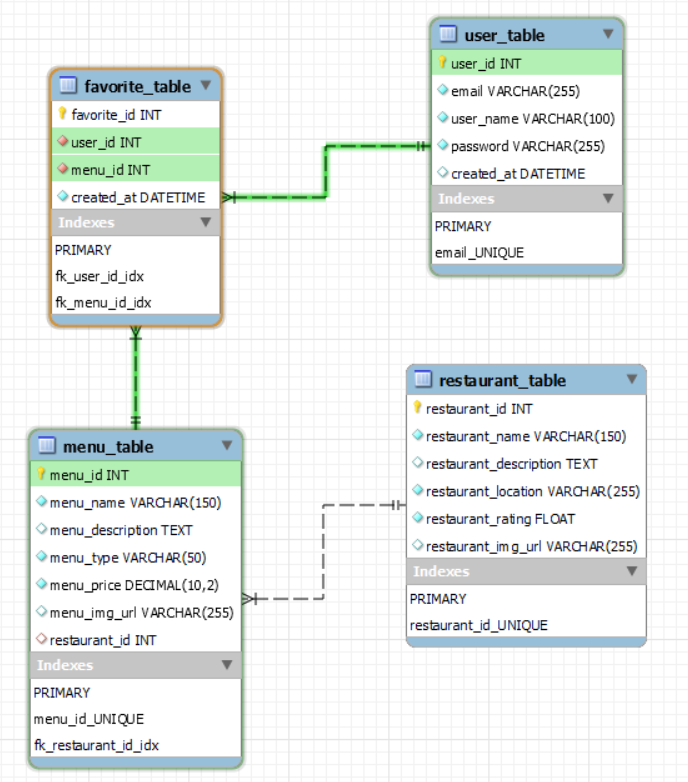

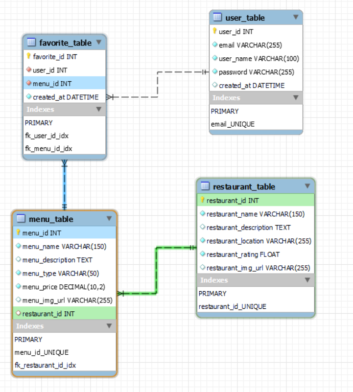
## API Endpoints

1. **Auth Routes**

    - **Register User**

        - **POST** `/auth/register`
        - **Request Body**: 
            ```json
            {
                "userID": "string",
                "emailID": "string",
                "userName": "string",
                "password": "string"
            }
            ```
        - **Response**: Success or error message
         
         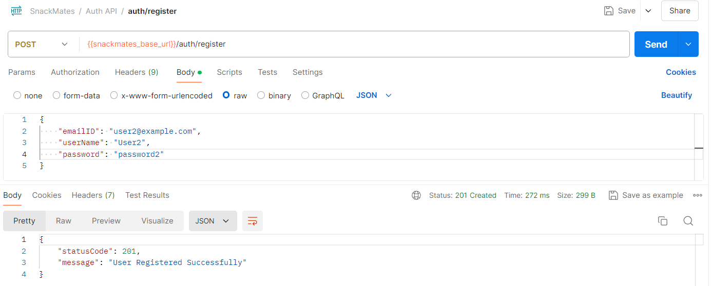

    - **Login User**

        - **POST** `/auth/login`
        - **Request Body**:
            ```json
            {
                "emailID": "string",
                "password": "string"
            }
            ```
        - **Response**: JWT token and user details 

        <br>  <!-- This adds a blank line -->
        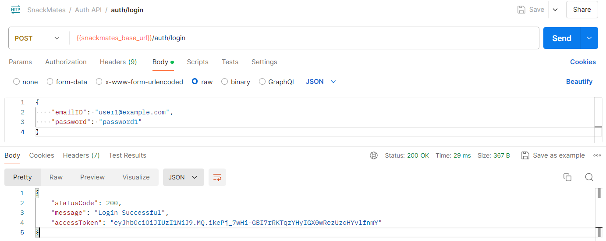
        
2. **Menu Routes**

    - **Get All Menus**

        - **GET** `/menus/all`
        - **Response**: List of all menus

        <br>  <!-- This adds a blank line -->
        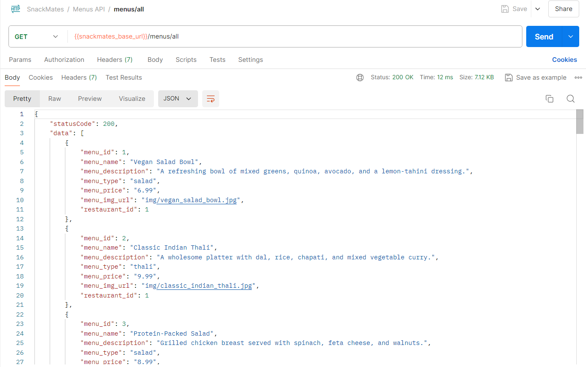


    - **Get Menu by ID**

        - **GET** `/menus/:menu_id`
        - **Response**: Menu details for the specified ID

        <br>  <!-- This adds a blank line -->
        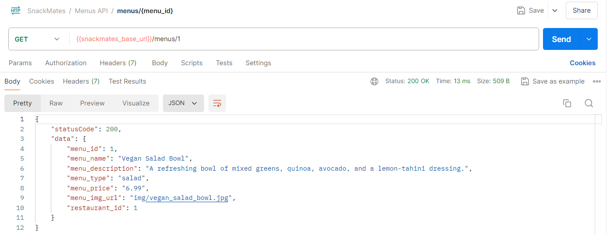

    - **Get Menus by Type**

        - **GET** `/menus/:menu_type`
        - **Response**: List of menus filtered by the specified type

        <br>  <!-- This adds a blank line -->
        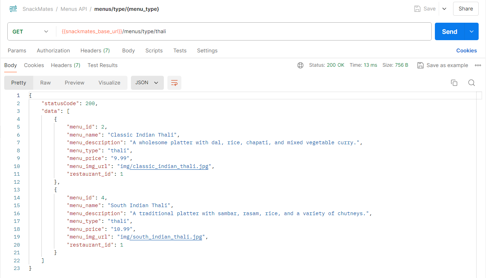

3. **Restaurant Routes**

    - **Get All Restaurants**

        - **GET** `/restaurants/all`
        - **Response**: List of all restaurants

        <br>  <!-- This adds a blank line -->
        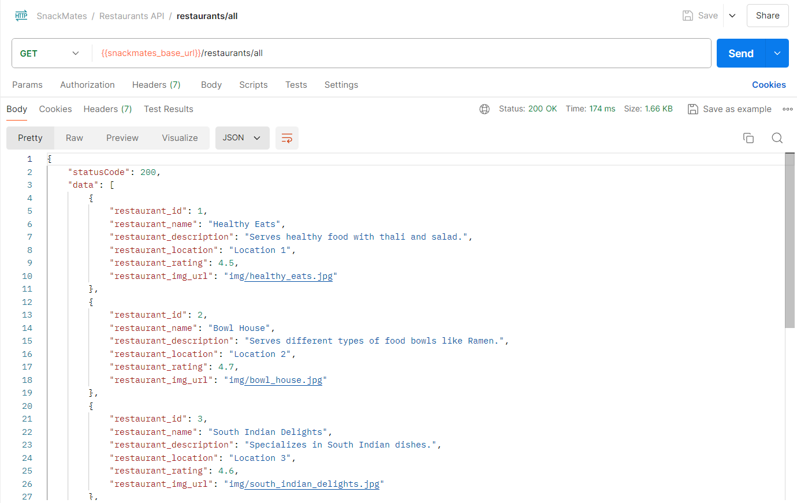

    - **Get Restaurant Menu**

        - **GET** `/restaurants/menu/:restaurant_id`
        - **Response**: List of menus for the specified restaurant

        <br>  <!-- This adds a blank line -->
        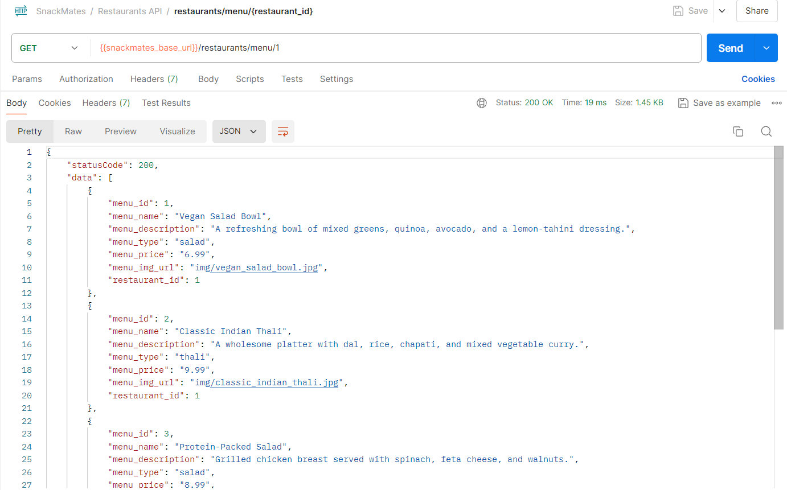

4. **Favorites Routes**

    - **Get User's Favorites**

        - **GET** `/favorites/all/:user_id`
        - **Response**: List of favorite items for the specified user

        <br>  <!-- This adds a blank line -->
        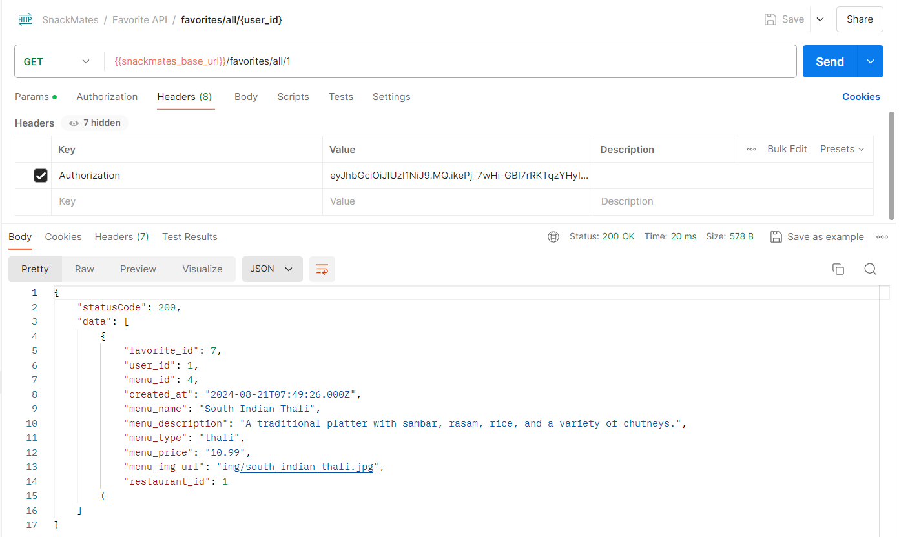

    - **Add to Favorites**

        - **POST** `/favorites/:user_id`
        - **Request Body**:
            ```json
            {
                "menu_id": "number"
            }
            ```
        - **Response**: Success or error message

        <br>  <!-- This adds a blank line -->
        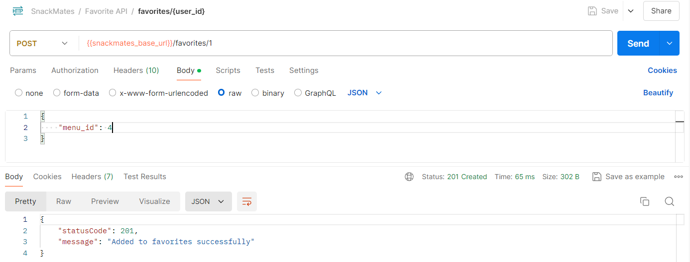

    - **Remove from Favorites**

        - **DELETE** `/favorites/:user_id/:favorite_id`
        - **Response**: Success or error message

        <br>  <!-- This adds a blank line -->
        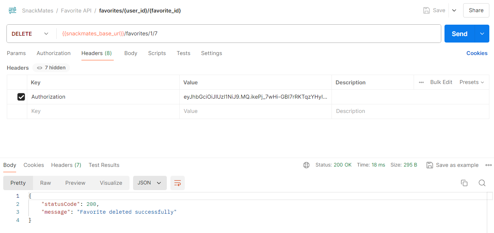

## Contributing

- Contributions are welcome! Please fork this repository and submit pull requests for any enhancements or bug fixes.